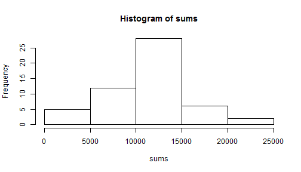
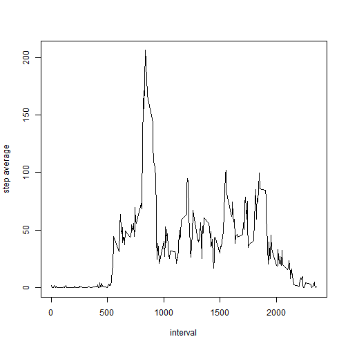
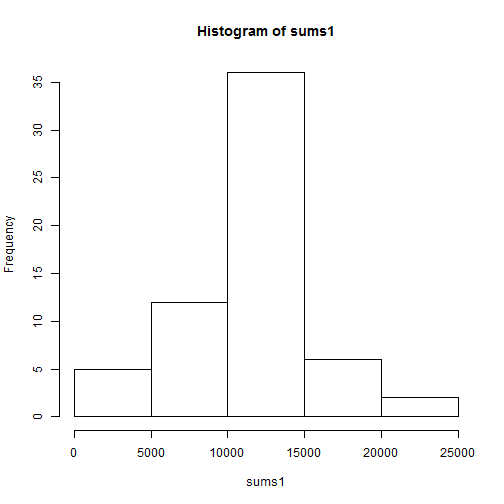

# Reproducible Research: Peer Assessment 1

## Loading and preprocessing the data
- Extract zip activity file from forked repository to generate the activity.csv file.
Read activity.csv into a dataframe.

```r
data <- read.csv("I:/Coursera/Reproducible research/git/RepData_PeerAssessment1/activity/activity.csv")
```
- Look at the data  

```r
class(data)
```

```
## [1] "data.frame"
```

```r
head(data)
```

```
##   steps       date interval
## 1    NA 2012-10-01        0
## 2    NA 2012-10-01        5
## 3    NA 2012-10-01       10
## 4    NA 2012-10-01       15
## 5    NA 2012-10-01       20
## 6    NA 2012-10-01       25
```

```r
str(data)
```

```
## 'data.frame':	17568 obs. of  3 variables:
##  $ steps   : int  NA NA NA NA NA NA NA NA NA NA ...
##  $ date    : Factor w/ 61 levels "2012-10-01","2012-10-02",..: 1 1 1 1 1 1 1 1 1 1 ...
##  $ interval: int  0 5 10 15 20 25 30 35 40 45 ...
```
## What is mean total number of steps taken per day?
- create histogram of total steps per day  

```r
sums <- tapply(data$steps, data$date, sum)
hist(sums)
```

 
---
- calculate mean and median of steps per day, removing na  

```r
print(mean(sums, na.rm = T))
```

```
## [1] 10766
```

```r
print(median(sums, na.rm = T))
```

```
## [1] 10765
```
## What is the average daily activity pattern?
- time series plot of 5 min intervals and average steps taken  

```r
step_av<-tapply(data$steps, data$interval, mean, na.rm = T)
plot(unique(data$interval), step_av,  type = "l", xlab = "interval", ylab = "step average")
```

 
---
- determine which interval has maximum number of steps  

```r
attr(which.max(step_av), "names")
```

```
## [1] "835"
```
## Imputing missing values
- total missing values

```r
na_steps <- is.na(data$steps)
missing <- data[na_steps,]
length(missing$steps)
```

```
## [1] 2304
```
- fill missing values and create new dataset 
use means of intervals over all days 

```r
for (i in 1:length(data[,1])) {
    if (is.na(data[i,1])) {
        est_step <- step_av[name=as.character(data[i,3])]
        names(est_step) <- NULL
        data[i,1]<-est_step
    }
}
print (head(data, 20))
```

```
##      steps       date interval
## 1  1.71698 2012-10-01        0
## 2  0.33962 2012-10-01        5
## 3  0.13208 2012-10-01       10
## 4  0.15094 2012-10-01       15
## 5  0.07547 2012-10-01       20
## 6  2.09434 2012-10-01       25
## 7  0.52830 2012-10-01       30
## 8  0.86792 2012-10-01       35
## 9  0.00000 2012-10-01       40
## 10 1.47170 2012-10-01       45
## 11 0.30189 2012-10-01       50
## 12 0.13208 2012-10-01       55
## 13 0.32075 2012-10-01      100
## 14 0.67925 2012-10-01      105
## 15 0.15094 2012-10-01      110
## 16 0.33962 2012-10-01      115
## 17 0.00000 2012-10-01      120
## 18 1.11321 2012-10-01      125
## 19 1.83019 2012-10-01      130
## 20 0.16981 2012-10-01      135
```
- plot histogram of steps per day  
and calculate mean and median steps per day

```r
sums1 <- tapply(data$steps, data$date, sum)
head(sums1)
```

```
## 2012-10-01 2012-10-02 2012-10-03 2012-10-04 2012-10-05 2012-10-06 
##      10766        126      11352      12116      13294      15420
```

```r
hist(sums1)
```

 

```r
print(mean(sums1))
```

```
## [1] 10766
```

```r
print(median(sums1))
```

```
## [1] 10766
```
- compare mean and median of original and revised (replaced NA) datasets

```r
library(data.table)
dt <- data.table(orig = c(mean(sums, na.rm=T), median(sums, na.rm=T)), rev = c(mean(sums1), median(sums1)))
print(dt)
```

```
##     orig   rev
## 1: 10766 10766
## 2: 10765 10766
```
## Are there differences in activity patterns between weekdays and weekends?
- add column to dataset for weekdays based on date column

```r
days<- factor(weekdays(as.Date(data$date)))
levels(days)[levels(days) == "Monday"] <-"weekday"
levels(days)[levels(days) == "Tuesday"] <-"weekday"
levels(days)[levels(days) == "Wednesday"] <-"weekday"
levels(days)[levels(days) == "Thursday"] <-"weekday"
levels(days)[levels(days) == "Friday"] <-"weekday"
levels(days)[levels(days) == "Saturday"] <- "weekend"
levels(days)[levels(days) == "Sunday"] <- "weekend"

#head(days)
data1<-cbind(data, days)
library(lattice)
```
- calculate mean of steps for each interval using aggregate, assign column names, and plot

```r
ag_data <- aggregate(data1$steps ~ data1$interval + data1$days, list(data1$days), mean)  

colnames(ag_data)<-c("interval", "days", "steps")

xyplot(steps ~ interval | days, data = ag_data, layout = c(1,2), type = "l")
```

 
